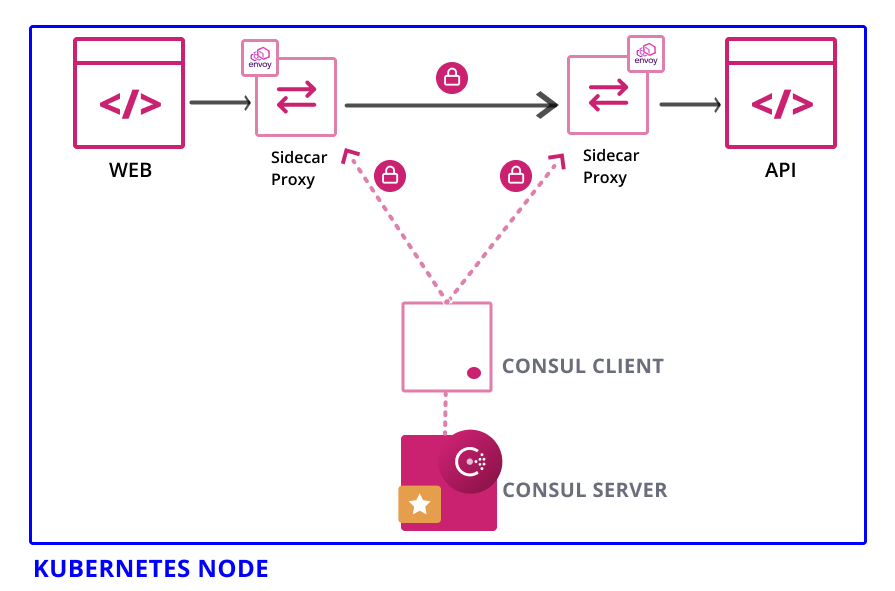
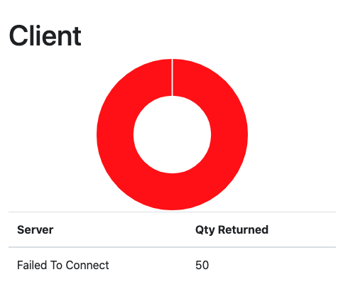
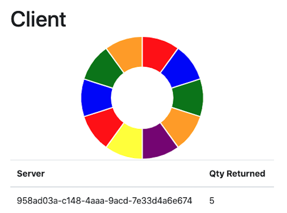

# Consul Connect
Consul "connect", HashiCorp's service mesh feature, provides service-to-service networking and security through connection authorization and encryption using mutual Transport Layer Security (mTLS). Applications deployed with the "connect" feature can use sidecar proxies in a service mesh configuration to establish TLS connections for inbound and outbound connections, without being aware of Consul at all.


## Consul Connect Testing

Using guide from [here](https://learn.hashicorp.com/tutorials/consul/service-mesh?utm_source=WEBSITE&utm_medium=WEB_IO&utm_offer=ARTICLE_PAGE&utm_content=DOCS)

## Steps to install
```bash
helm repo add hashicorp https://helm.releases.hashicorp.com
helm install -f consul-values.yml hashicorp hashicorp/consul

kubectl get services
```

## To Access UI
```bash
kubectl port-forward service/hashicorp-consul-ui 18500:80 --address 0.0.0.0
```
[Local Link](http://127.0.0.1:18500/)

## To Access CLI
```bash
kubectl exec -it hashicorp-consul-server-0 -- /bin/sh
consul members
```

# Zero Trust Network
Consul service mesh allows you to deploy applications into a zero-trust network. A zero-trust network is a network where nothing is trusted automatically: all connections must be verified and authorized. This paradigm is important in microservices and multi-cloud environments where many applications and services are running in the same network.

In this section we will deploy two services, server and ui, into Consul's service mesh running on a Kubernetes cluster. The two services will use Consul to discover each other and communicate over mTLS with sidecar proxies. This is the first step in deploying application into a zero-trust network.



## Deploy Tutoiral services
```bash
kubectl apply -f ./k8s_config/api.yml
kubectl apply -f ./k8s_config/web.yml
kubectl get deployments.apps --watch

kubectl port-forward service/hashicorp-consul-ui 18500:80 --address 0.0.0.0
kubectl port-forward service/web 9090:9090 --address 0.0.0.0
```
[Local Link](http://127.0.0.1:18500/)
[Fake Service](http://127.0.0.1:9090/ui)

## Cleanup Tutoiral Services
```bash
kubectl delete -f k8s_config/api.yml
kubectl delete -f k8s_config/web.yml
```

## Deploy Example Server/Client services from this repo
```bash
kubectl apply -f ./k8s_config/server.yml
kubectl apply -f ./k8s_config/client.yml
kubectl get deployments.apps --watch

kubectl port-forward service/hashicorp-consul-ui 18500:80 --address 0.0.0.0
kubectl port-forward service/client 3000:3000 --address 0.0.0.0
```
[Local Link](http://127.0.0.1:18500/)
[Dashboard](http://127.0.0.1:3000)

## Cleanup Example Server/Client services from this repo
```bash
kubectl delete -f k8s_config/server.yml
kubectl delete -f k8s_config/client.yml
```

# Zero-trust Network
Above we deployed two services into your Consul service mesh and secured service-to-service communication with sidecar proxies. This is the first step to configure a zero-trust network and ensure that the communication between your services is automatically verified and encrypted using mutual TLS (mTLS). The second step is to ensure all connections are authorized. Before microservices, authorization was defined with firewall rules and routing tables.

## Create Block All Intention
**CLI**
```bash
kubectl exec -it hashicorp-consul-server-0 /bin/sh
consul intention create -deny "*" "*"
consul intention check web api
```

**UI**
```bash
kubectl port-forward service/hashicorp-consul-ui 18500:80 --address 0.0.0.0
```

[Go To Consul UI](http://127.0.0.1:18500/)

* Intentions > Create
* Source (All Services)
* Destination (All Services)

## Permit Service Communication
**CLI**
```bash
kubectl exec -it hashicorp-consul-server-0 /bin/sh
consul intention create -allow web api
consul intention create -allow client server
```

|||
|:--:|:--:|
|*Block All*||*Allow client server*|
