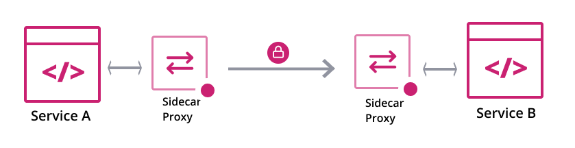

# Consul Connect
Consul "connect", HashiCorp's service mesh feature, provides service-to-service networking and security through connection authorization and encryption using mutual Transport Layer Security (mTLS). Applications deployed with the "connect" feature can use sidecar proxies in a service mesh configuration to establish TLS connections for inbound and outbound connections, without being aware of Consul at all.



# Consul Connect Testing

Using guide from [here](https://learn.hashicorp.com/tutorials/consul/service-mesh?utm_source=WEBSITE&utm_medium=WEB_IO&utm_offer=ARTICLE_PAGE&utm_content=DOCS)

# Steps to install
```bash
helm repo add hashicorp https://helm.releases.hashicorp.com
helm install -f consul-values.yml hashicorp hashicorp/consul

kubectl get services
```

# To Access UI
```bash
kubectl port-forward service/hashicorp-consul-ui 18500:80 --address 0.0.0.0
```
[Local Link](http://127.0.0.1:18500/)

# To Access CLI
```bash
kubectl exec -it hashicorp-consul-server-0 -- /bin/sh
consul members
```